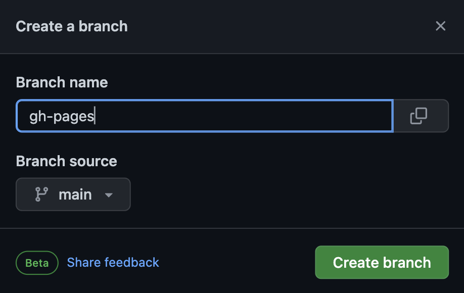
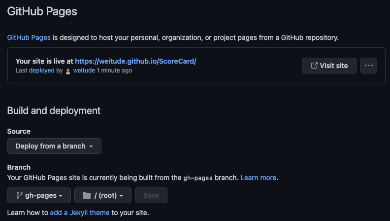
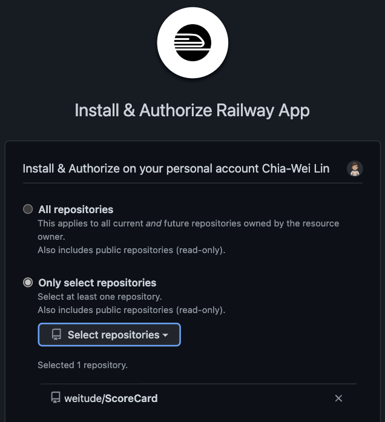
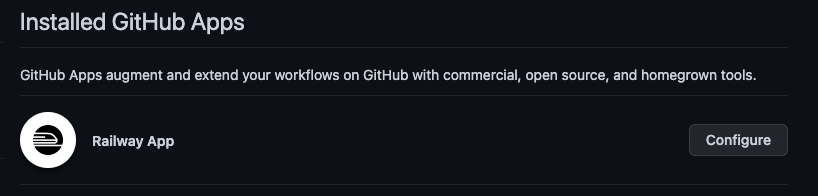
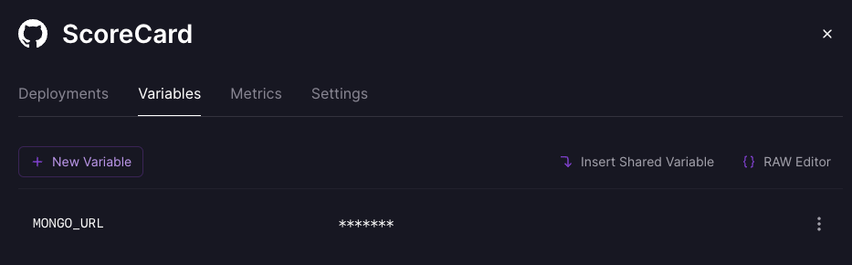

# Web Programming HW#9

## 前言

我部署的是 hw6 ScoreCard

首先先去 GitHub 開一個新的 repo 叫 ScoreCard

接著先將 hw6 的內容直接複製到 repo 中，進行初始化

- frontend: [https://weitude.github.io/ScoreCard](https://weitude.github.io/ScoreCard/)
- backend: [https://weitude-scorecard.up.railway.app](https://weitude-scorecard.up.railway.app)

  可利用 [https://weitude-scorecard.up.railway.app/health](https://weitude-scorecard.up.railway.app/health) 來檢查
  server 是否運作

---

## frontend

新增一個 branch，用來部署 GitHub Pages



設定 GitHub Pages



在 frontend 中執行以下指令：

```
yarn add -D gh-pages
```

`vim package.json`

```
{
  "name": "frontend",
  "version": "0.1.0",
  "homepage": "https://weitude.github.io/ScoreCard",
  "private": true,
  ...
  "scripts": {
  "predeploy": "npm run build",
  "deploy": "gh-pages -b gh-pages -d build",
  "start": "react-scripts start",
  "build": "react-scripts build",
  "test": "react-scripts test",
  "eject": "react-scripts eject"
  },
  ...
}
```

```
npm run deploy
```

這樣就能成功部署 frontend 在 GitHub Pages 了！

---

## backend

這部分比較複雜，我使用 Docker 部署在 Railway

首先，先進入 Railway 的網站，並且設定好





新增 `MONGO_URL`



因為 deploy server 最好用 node 開啟，所以不繼續使用 nodemon 套件

`vim package.json`

```
{
  "type": "module",
  "name": "backend",
  "version": "1.0.0",
  ...
  "scripts": {
  "start:prod": "node src/server.js",
  "server": "nodemon src/server.js --ext js --exec babel-node"
  },
  ...
}
```

接著撰寫 `Dockerfile`

```docker
FROM alpine:latest

RUN apk add --no-cache --update nodejs yarn

WORKDIR /usr/src/app

COPY backend/package.json backend/yarn.lock ./
COPY backend/src ./src

RUN yarn install --production

EXPOSE 4000

CMD yarn start:prod
```

這樣當我們 push 到 GitHub 時，Railway 會自動幫我們抓資料，

並且根據 `Dockerfile` 來創造 server

---

## Reference

[gitname/react-gh-pages: Deploying a React App (created using create-react-app) to GitHub Pages](https://github.com/gitname/react-gh-pages)

[javascript - (node:9374) Warning: To load an ES module, set "type": "module" - Stack Overflow](https://stackoverflow.com/questions/63588714/node9374-warning-to-load-an-es-module-set-type-module)

[javascript - Error [ERR_MODULE_NOT_FOUND]: Cannot find module - Stack Overflow](https://stackoverflow.com/questions/65384754/error-err-module-not-found-cannot-find-module)

[CommonJS和ES6模块的区别 - 掘金 (juejin.cn)](https://juejin.cn/post/6844904067651600391)

[實測有效！手把手帶你將 Docker Image 體積減少 90% | by 林鼎淵 | Dean Lin | Medium](https://medium.com/dean-lin/%E5%AF%A6%E6%B8%AC%E6%9C%89%E6%95%88-%E6%89%8B%E6%8A%8A%E6%89%8B%E5%B8%B6%E4%BD%A0%E6%B8%9B%E5%B0%91-90-%E7%9A%84-docker-image-%E9%AB%94%E7%A9%8D-10b8e43159ff)